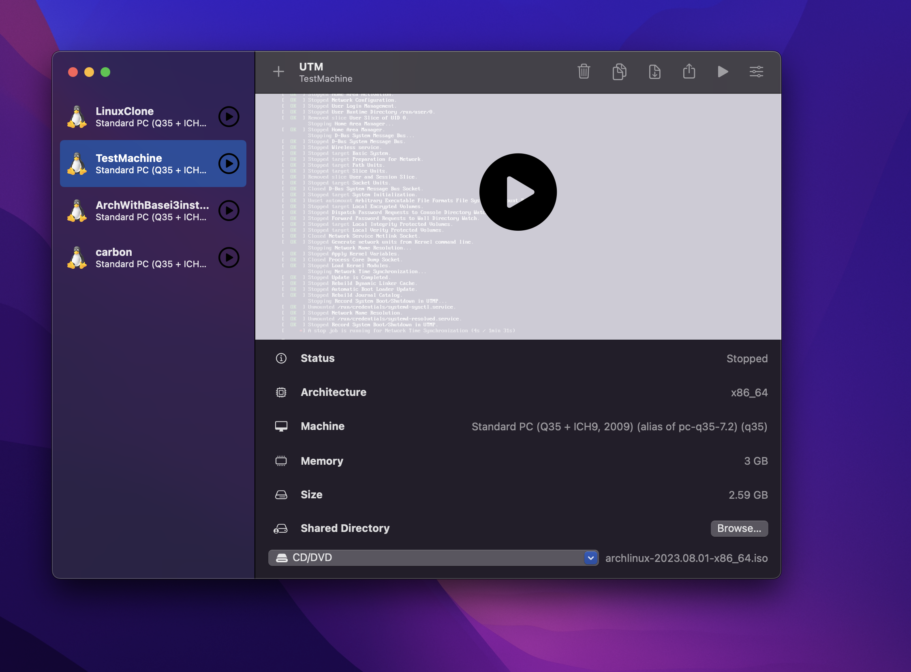
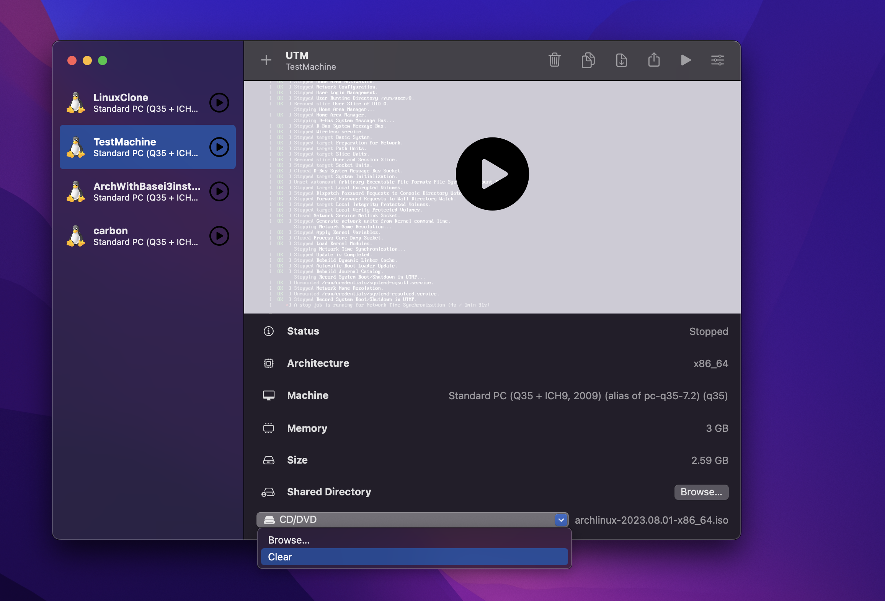
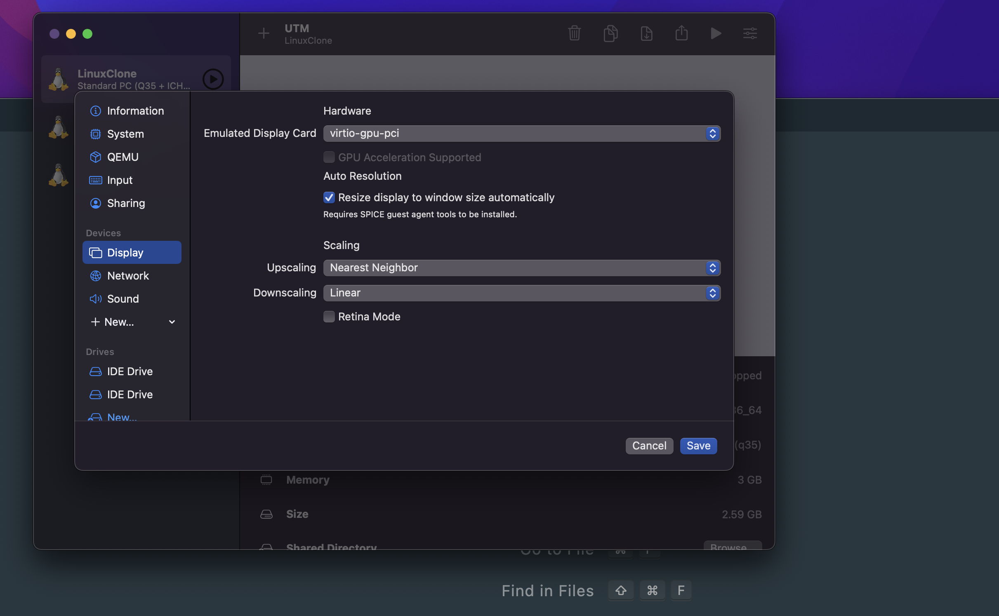
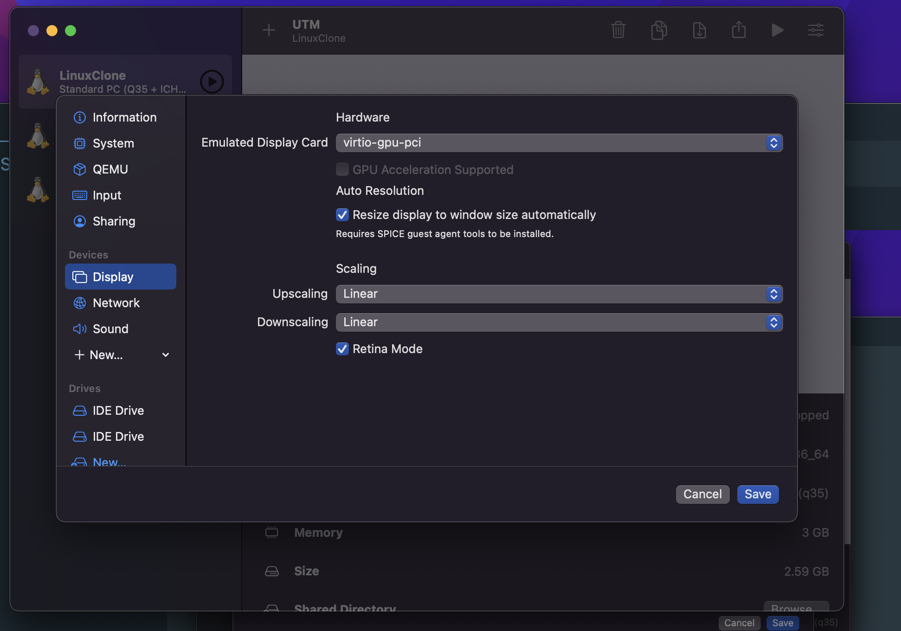

# Basic Installation of ArchLinux with UTM on MacOS

I have tried Virtual Box, Parallels, Vmware Fusion and UTM with lots of distros like Fedora, Ubuntu, Lubuntu, Arch, LinuxMint, Pop-OS. But all of them were creating a lot of heat on the machine except Arch.

Arch is stable even after installing i3wm but if you install Desktop Environments like Gnome, it is heavier on RAM.
I am using 16GB Intel Chip Macbook Pro for this.

Please note that I have allocated 3GB of RAM to Arch in UTM and 64 GB of space.

On MacOS, installing Arch is the best option that I have encountered while trying all other distros.

### Installing Arch with archinstall

This guide assumes that you can install arch linux using archinstall script. 
```bash
sudo pacman -Syyu
sudo pacman -Syy archinstall
archinstall
```
Follow the wizard and once you are all done, do a 
```
sudo shutdown
```

Once arch linux is installed, go to your machine on UTM and remove archlinux iso by clicking on CD/DVD drop-down 



and clicking Clear



### After installing arch

1. Start your machine again and login with your newly created user. 
2. Run following command `sudo pacman -S git`
3. Once git is installed, execute following command:
4. Execute 
```
mkdir ins;
cd ins;
git clone https://github.com/zirith001/installArch.git .
bash install.sh;
```
5. You will be prompted with i3wm welcome manager. Just follow the wizard by pressing Enter.


Now again shutdown your machine with `sudo shutdown now`, and in UTM, go to settings of the machine, change:

Display: Upscaling: Nearest Neighbour


to

Display: Upscaling: Linear

and enable Retina Mode




### Change default login terminal to alacritty

Modify /usr/bin/i3-sensible-terminal, and change the order of the terminals. 
Ex: by default the file is something like:

for terminal in "$TERMINAL" x-terminal-emulator urxvt (etc etc) alacritty (etc etc)

You could modify it so that alacritty appears in the list before urxvt, and is therefore loaded first:

for terminal in "$TERMINAL" alacritty x-terminal-emulator urxvt (etc etc)


NOTE: Special thanks to [3rfaan](https://github.com/3rfaan). This repo is hugely inspired by his work.